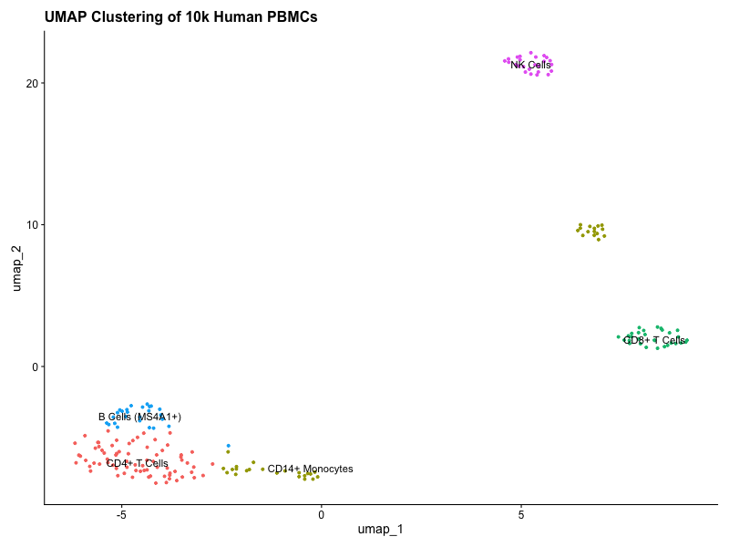

# End-to-End Single-Cell RNA-Seq Pipeline (10k Human PBMCs)

An automated, version-controlled bioinformatics pipeline analyzing 10,000 Human Peripheral Blood Mononuclear Cells (PBMCs) from a healthy donor utilizing **Seurat v5** and **R**.

## Pipeline Architecture
The project structure is split cleanly into bash asset handlers and analytical R scripts to ensure technical portability and reproducibility:
* `src/01_download_qc.sh`: Automates data acquisition from 10x Genomics, handles workspace setups, and validates checksum integrity.
* `src/02_analysis.R`: The processing engine—manages data filtering, global log-normalization, principal component scaling, graph-based Louvain clustering, and non-linear UMAP projection.

## Quality Control & Curation Filters
To isolate high-fidelity single-cell transcriptomes from background technical artifacts, strict data filters were manually implemented based on distribution profiles:
* **Cell Metric Boundaries:** Retained cells expressing between **200 and 2,500 unique features (`nFeature_RNA`)**. This efficiently isolates real cellular droplets while filtering out empty wells (low count bounds) and multiplets (abnormally high count bounds).
* **Mitochondrial Thresholding:** Removed cells displaying **>5% mitochondrial read fractions (`percent.mt`)** to discard low-quality, lysing, or apoptotic cells.

## Biological Interpretation & Cell Identification
Unsupervised clustering separated the heterogeneous population into distinct immune cell lineages. Cluster verification was performed by mapping canonical marker expression patterns across highly variable genes:

| Identified Lineage | Key Canonical Markers | Biological Role |
| :--- | :--- | :--- |
| **CD4+ T Cells** | *IL7R, CCR7* | Helper lymphocytes regulating immune response orchestration. |
| **CD14+ Monocytes** | *CD14, LYZ* | Core myeloid cells responsible for phagocytosis and antigen presentation. |
| **CD8+ T Cells** | *CD8A, CD8B* | Cytotoxic T lymphocytes specializing in destroying infected cells. |
| **B Cells** | *MS4A1 (CD20), CD79A* | Humoral immunity drivers specializing in target-specific antibody production. |
| **NK Cells** | *GNLY, NKG7* | Natural Killer cells initiating rapid innate responses against viral stress. |

### Visualizing the Transcriptomic Landscape
The final topological landscape is visualized below via Uniform Manifold Approximation and Projection (UMAP). This embedding illustrates clean lineage grouping while highlighting transitional proximity between cell states:

## How to Reproduce Locally
1. Clone the repository: `git clone https://github.com/kiyounghan/YOUR_REPO_NAME.git`
2. Fetch the source archive and build directories: `bash src/01_download_qc.sh`
3. Execute the analysis suite: `Rscript src/02_analysis.R`

